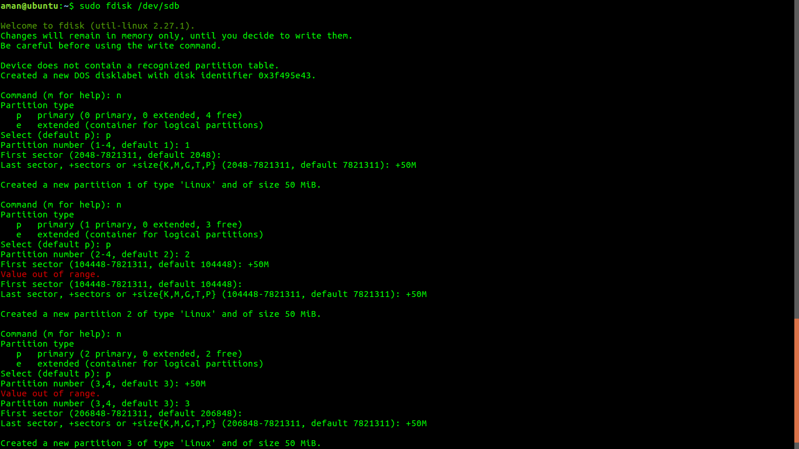

# TASK 1 :- Make 5 partitions in pendrive

* Making partitions

   ```
    umount /dev/sdb1       //to unmount the pendrive
    lsblk                 //to check whether pendrive is still mounted or not
    fdisk /dev/sdb        // making partition

   ```

* partition to be saved
 
- First partition –     n -> p -> 1 -> enter -> +10M //sdb1
   
- Second partition -  n -> p -> 2 -> enter -> +10M   //sdb2
 
- Third partition -    n -> p -> 3 -> enter -> +10M //sdb3


 
- Extended part     - n -> e -> enter -> +2G        //sdb4

- Fourth partition -  n -> enter -> +50M            //sdb5

- Fifth partition -   n  -> enter -> +50M           //sdb6    


    saving partition- w -> (saves the partition on disk) 


## Mounting these partitions:-   

* making mount points
    ```
      sudo mkdir mnt{1..5}  
    ```

* giving them file system
   ```
     sudo mkfs.ext4 /dev/sdb1 //giving file system to 1st partition
     sudo mkfs.ext4 /dev/sdb2 //giving file system to 2ndpartition
     sudo mkfs.ext4 /dev/sdb3 //giving file system to 3rdpartition
     sudo mkfs.ext4 /dev/sdb5 //giving file system to 4thpartition
     sudo mkfs.ext4 /dev/sdb6 //giving file system to 5thpartition
   ```
* mounting partition on respective mount point

 ```
   sudo mount /dev/sdb1 /mnt1
   sudo mount /dev/sdb2 /mnt2
   sudo mount /dev/sdb3 /mnt3
   sudo mount /dev/sdb5 /mnt4
   sudo mount /dev/sdb6 /mnt5
 ```

## Checking

* make file in every partition

```
   cd /mnt1
   sudo touch ninja
   sudo umount /dev/sdb1

   cd /mnt2
   sudo touch ninja
   sudo umount /dev/sdb2

   cd /mnt3
   sudo touch ninja
   sudo umount /dev/sdb3

   cd /mnt4
   sudo touch ninja
   sudo umount /dev/sdb4

   cd /mnt5
   sudo touch ninja
   sudo umount /dev/sdb5
```
# Task2 :- Logical Volume Management

* Creating a LVM of 1GB
```
 sudo lvmdiskscan
 sudo pvcreate /dev/sdb
 sudo pvs
 sudo vgcreate oneplus /dev/sdb
 sudo vgs
 sudo lvcreate -L 1G -n oneplus_logical oneplus
 sudo vgs
 sudo lvdisplay
```
* Extending the size to 1.5GB
```
 sudo lvextend -L+500M /dev/oneplus/oneplus_logical
 sudo lvextend -L+500M /dev/oneplus/oneplus_logical
 sudo lvdisplay
```

* Reducing the size to 500MB

```
sudo lvreduce -L 500M /dev/oneplus/oneplus_logical
sudo lvdisplay
```
